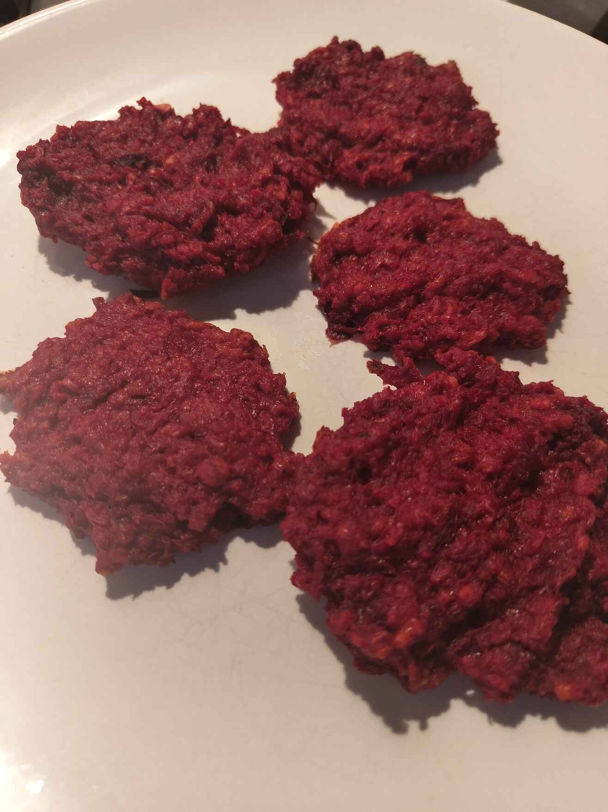

Poznámky:

- 20 minút pečenia na 180 stupňoch je málo, treba to buď po 10 minútach zvýšiť na 200 alebo celý čas mať nastavené na 190
- do cesta by sa mohla hodiť aj nastrúhaná mrkva alebo čosi také
- ako príloha sa hodia zemiaky a šalát

[Link na recept.](https://www.fitrecepty.sk/recept/zdrave-karbanatky-z-cervenej-repy)
