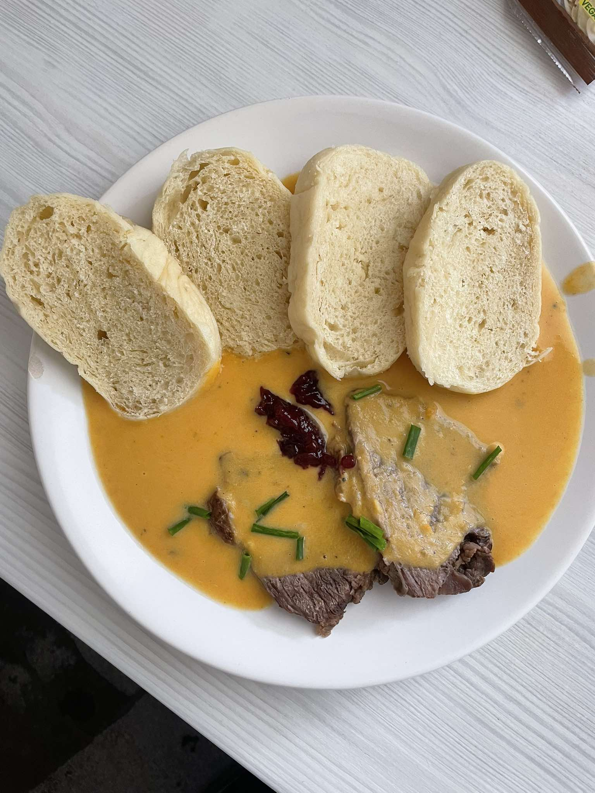

Poznámky:

- viac mrkvy, ideálne 3-4 väčšie kusy
- namiesto vody zaliať slabším hovädzím vývarom
- mäso (so zeleninou) variť približne 2 hodiny
- s citrónom opatrne, radšej postupne pridávať nech to zrazu nie je príliš kyslé

[Link na recept.](https://www.youtube.com/watch?v=FOjFeNiQnp8)
